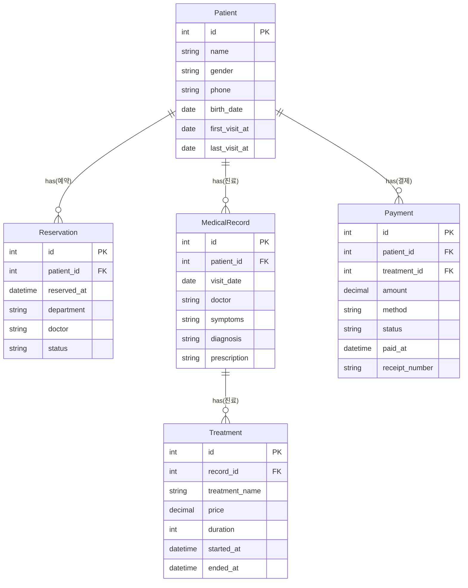

# ORM Performance Benchmark

TypeScript + Node.js 환경에서 **Sequelize**, **Prisma**, **TypeORM**, **Drizzle** 네 개의 주요 ORM을 실제 **피부과 CRM 시스템**으로 모킹하여 성능을 비교 분석하는 벤치마크 프로젝트입니다.

## 🎯 프로젝트 목표

- **실전 환경**: 실제 CRM 시스템의 복잡한 도메인 모델과 관계를 반영
- **대용량 데이터**: 10만건 수준의 데이터로 실제 운영 환경 시뮬레이션
- **종합적 평가**: CRUD 성능, 트랜잭션 처리, 복잡 쿼리, 메모리 사용량 등 다각도 분석
- **객관적 비교**: 동일한 환경과 조건에서 공정한 성능 비교

## 🏗️ 시스템 아키텍처

### 도메인 모델 (피부과 CRM)

```bash
Patient (환자)
├── 1:N Reservation (예약)
├── 1:N MedicalRecord (진료기록)
│   └── 1:N Treatment (시술)
└── 1:N Payment (결제)
```

### 주요 엔티티

- **Patient**: 환자 정보 (이름, 성별, 연락처, 첫방문일 등)
- **Reservation**: 예약 정보 (예약일시, 진료과, 담당의 등)
- **MedicalRecord**: 진료기록 (증상, 진단, 처방 등)
- **Treatment**: 시술 정보 (시술명, 가격, 소요시간 등)
- **Payment**: 결제 정보 (금액, 결제방법, 결제상태 등)

### 다이어그램



## seed 데이터 예상 분포

- 환자: 100,000명
- 예약: 약 825,000건 (평균 8.25건/환자)
- 진료기록: 약 550,000건 (평균 5.5건/환자)
- 시술: 약 550,000건 (진료기록과 1:1)
- 결제: 약 550.000건 + 10% (예약 기반 + 10% 복잡 시나리오)

## 🛠️ 기술 스택

- **Runtime**: Node.js 22.19.0
- **Language**: TypeScript 5.5.2
- **Database**: PostgreSQL 15 (Docker)
- **ORMs**: Sequelize `6.37.3`, Prisma `6.15.0`, TypeORM `0.3.20`, Drizzle `0.44.5`
- **Testing**: Faker.js 8.4.1 (데이터 생성), CLI Table 0.6.4 (결과 출력)
- **Build Tools**: Drizzle Kit 0.31.4, ts-node 10.9.2

## 📦 설치 및 설정

### 1. 프로젝트 클론

```bash
git clone <repository-url>
cd orm-benchmark
```

### 2. 환경 설정

```bash
mkdir env
cp env.template env/local.env
```

### 3. 쉘 스크립트로 밴치마크 환경 셋팅

```bash
# npm 의존성 & 컨테이너 생성 & orm별 마이그레이션 & seed 데이터 주입
sh setup.sh
```

### 4. 밴치마크 시작

```bash
## 순차적으로 일괄 수행
npm run benchmark:all

## 각각 수행
npm run benchmark:sequelize
npm run benchmark:prisma
npm run benchmark:typeorm
npm run benchmark:drizzle
```

### 5. 환경 정리

```bash
# 컨테이너 볼륨 제거 및 컨테이너 종료/제거
sh reset.sh
```

## 🚀 상세 사용법

### 전체 벤치마크 실행

```bash
# 모든 ORM 벤치마크 실행
npm run benchmark:all

# 또는 특정 ORM만 실행
npm run benchmark:sequelize
npm run benchmark:prisma
npm run benchmark:typeorm
npm run benchmark:drizzle
```

### 시드 데이터 생성

```bash
# 모든 ORM에 시드 데이터 생성 (기본 10만건)
npm run db:seed:all

# 또는 개별 실행
npm run db:seed:sequelize
npm run db:seed:prisma
npm run db:seed:typeorm
npm run db:seed:drizzle
```

### 환경변수 설정

```bash
# env/local.env 파일에서 설정 가능
BENCHMARK_TOTAL_RECORDS=100000  # 생성할 총 환자 수
BENCHMARK_BATCH_SIZE=1000       # 배치 처리 단위
BENCHMARK_CONCURRENCY=10        # 동시 처리 수
BENCHMARK_REPORT_MODE=files     # 리포트 모드 (file, console, all)
PRISMA_SEED_MODE=flat          # Prisma 시드 모드 (flat, nested)
```

## 📊 벤치마크 테스트 항목

### 1. 단순 읽기 (Simple Read)

- **목적**: 기본적인 SELECT 성능 측정
- **테스트**: 환자 데이터 1,000건 / 10,000건 조회 (페이징)
- **측정**: 응답시간, 메모리 사용량

### 2. 단순 쓰기 (Simple Write)

- **목적**: 대량 INSERT 성능 측정
- **테스트**: 환자 데이터 1,000건 / 5,000건 일괄 삽입
- **측정**: 처리시간, 초당 처리건수 (TPS)

### 3. 복잡 트랜잭션 (Complex Transaction)

- **목적**: 실전 비즈니스 로직의 트랜잭션 성능
- **테스트**: 환자 등록 + 예약 + 진료기록 + 시술 + 결제 (100/500건)
- **측정**: 트랜잭션 완료시간, 실패율

### 4. 단순 통계 (Simple Stats)

- **목적**: 집계 쿼리 성능
- **테스트**: 최근 30일 일별 신규 환자 수 조회
- **측정**: 쿼리 실행시간

### 5. 복잡 통계 (Complex Stats)

- **목적**: 복잡한 JOIN과 집계 성능
- **테스트**: 의사별 시술 매출 순위 (TOP 10)
- **측정**: 복잡 쿼리 실행시간

### 6. 중첩 삽입 (Nested Insert)

- **목적**: 복잡한 관계형 데이터 일괄 삽입 성능
- **테스트**: 환자 + 예약 + 진료기록 + 시술 + 결제를 한번에 생성 (100/500건)
- **측정**: 중첩 삽입 처리시간, 메모리 사용량

### 7. 대량 업데이트 (Bulk Update)

- **목적**: UPDATE 성능 측정
- **테스트**: 환자 1,000건 마지막 방문일 업데이트
- **측정**: 업데이트 처리시간

### 8. 대량 삭제 (Bulk Delete)

- **목적**: DELETE 성능 측정
- **테스트**: 1년 이상 된 환자 데이터 삭제 (현재 비활성화)
- **측정**: 삭제 처리시간, CASCADE 성능

## 📈 결과 리포트

벤치마크 완료 후 다음 형태로 결과가 생성됩니다:

### 콘솔 출력

```
📊 ORM Performance Benchmark Results
================================================================================

🔧 Sequelize Results:
┌─────────────────────────────────────┬─────────────────┬────────────┬──────────────────┬───────────────┐
│ Operation                           │ Duration (ms)   │ Records    │ Avg/Record (ms)  │ Memory (MB)   │
├─────────────────────────────────────┼─────────────────┼────────────┼──────────────────┼───────────────┤
│ Simple Read (limit: 1000)           │ 45.32           │ 1,000      │ 0.0453           │ 12.45         │
│ Simple Write (1000 records)         │ 234.56          │ 1,000      │ 0.2346           │ 18.92         │
...
```

### 파일 출력

- **JSON**: `results/{orm}-{timestamp}.json` - 상세 결과 데이터
- **CSV**: `results/{orm}-{timestamp}.csv` - 스프레드시트 분석용
- **Markdown**: `results/{orm}-{timestamp}.md` - 보고서 형태
- **Console**: 실시간 콘솔 출력 (테이블 형태)

## 🔧 프로젝트 구조

```
orm-benchmark/
├── src/
│   ├── types/           # 공통 타입 정의
│   ├── utils/           # 유틸리티 (DB연결, Faker, 성능측정)
│   ├── benchmark/       # 벤치마크 기본 클래스 및 리포터
│   └── orm/
│       ├── sequelize/   # Sequelize 구현
│       │   ├── models/     # 모델 정의
│       │   ├── config.ts   # DB 설정
│       │   ├── migrate.ts  # 마이그레이션
│       │   ├── seed.ts     # 시드 데이터
│       │   └── benchmark.ts # 벤치마크
│       ├── prisma/      # Prisma 구현
│       ├── typeorm/     # TypeORM 구현
│       └── drizzle/     # Drizzle 구현
├── env/                 # 환경변수 설정
├── scripts/            # DB 초기화 스크립트
├── results/            # 벤치마크 결과
├── docker-compose.yml  # PostgreSQL 컨테이너
└── package.json        # 스크립트 및 의존성
```

## 📋 개발 가이드

### 새로운 ORM 추가

1. `src/orm/{orm_name}/` 디렉토리 생성
2. `BaseBenchmark`를 상속하는 벤치마크 클래스 구현
3. 동일한 도메인 모델 정의
4. `package.json`에 스크립트 추가

### 새로운 테스트 추가

1. `BaseBenchmark`에 추상 메서드 추가
2. 각 ORM별 구현체에서 메서드 구현
3. `runAll()` 메서드에 테스트 추가

### 추가 스크립트

```bash
# 개발 모드 실행
npm run start:dev

# 디버그 모드 실행
npm run start:debug

# Prisma Studio 실행
npm run studio:prisma

# Drizzle Studio 실행
npm run studio:drizzle

# Prisma 리셋
npm run db:reset:prisma

# Drizzle 스키마 생성
npm run db:generate:drizzle

# Drizzle 스키마 푸시
npm run db:push:drizzle
```

## 🚨 주의사항

- **대용량 데이터**: 10만건 시드 생성시 시간이 오래 걸릴 수 있습니다 (5-10분)
- **DB 연결**: PostgreSQL 컨테이너가 완전히 시작된 후 마이그레이션을 실행하세요
- **스키마 분리**: 각 ORM은 별도 스키마를 사용하여 격리됩니다
- **메모리 사용량**: 벤치마크 실행시 충분한 메모리가 필요합니다 (최소 4GB 권장)
- **리포트 모드**: `BENCHMARK_REPORT_MODE` 환경변수로 출력 방식을 제어할 수 있습니다
- **Prisma 시드**: `PRISMA_SEED_MODE`로 flat/nested 시드 방식을 선택할 수 있습니다
